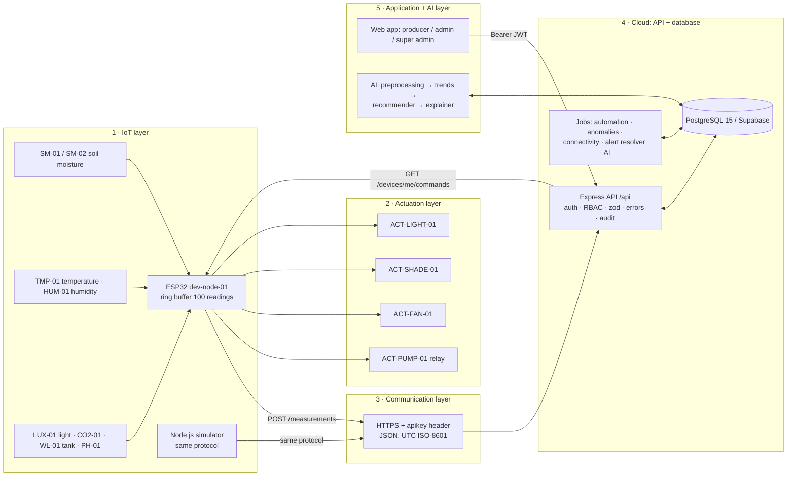
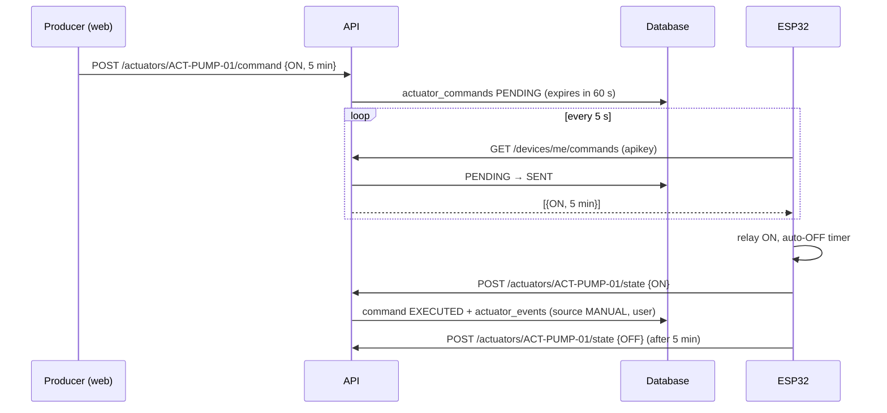
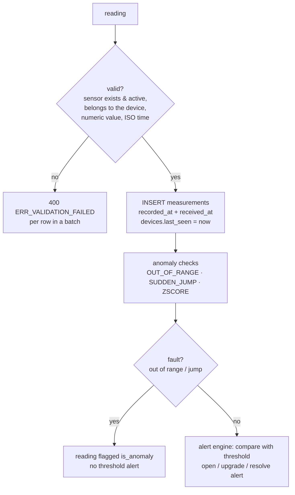
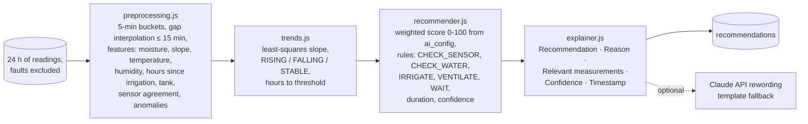

# Architecture — SmartGreenAI: Cilantro Crop

The platform follows the five layers of the project document. Each layer lives in its own folder and talks to
the others only through the HTTP API or the database. IoT, backend, frontend, database and AI can therefore
evolve independently (NFR-07).



## 1. IoT layer

- **Firmware** `iot/esp32_smartgreen/esp32_smartgreen.ino` evolves the Sprint 1 sketch (`sensors_croph_cilantro1_Oscar.ino`)
  and keeps its identifiers: GH-01, AREA-1, SM-01, SM-02, TMP-01. The soil probes are powered only while
  reading, to limit corrosion. NTP provides UTC time, so every reading carries `recorded_at`.
- **Buffer and retry** (US06-T4): readings go into a 100-slot ring buffer. The whole buffer is sent as one array.
  On failure it is kept, with back-off from 2 s up to 60 s. When the buffer is full, the oldest reading is dropped.
- **Simulator** `iot/simulator/simulator.js` speaks the same protocol and adds a closed-loop greenhouse model plus
  ten scenarios (dry, hot, spike, flatline, disconnect, low-tank, outlier, acceptance…).

## 2. Actuation layer

Commands are **pulled** by the device, which works behind NAT and needs no open port on the ESP32:



A command nobody collects within 60 s becomes EXPIRED (US15-T5). Only one command per actuator may be in flight.
The heartbeat (every 30 s) reports the actuator states, so an idle actuator isn't shown as OFFLINE.
The dashboard shows OFFLINE after 5 minutes without any report (US-14).

## 3. Communication layer

- Devices authenticate with the `apikey` header. The server keeps only its SHA-256 hash (US25-T4, NFR-09),
  and a deactivated device or a rotated key gets 401.
- Users authenticate with `Authorization: Bearer <JWT>` (HS256). The expiry comes from `security_settings`
  (default 8 h).
- Production traffic goes through HTTPS (TLS terminated by Render/Railway or by Nginx, see DEPLOYMENT.md).
  The firmware can pin the server CA (`API_ROOT_CA`).
- Every error follows one contract: `{ status, code, message, details[] }`, with the codes
  `ERR_VALIDATION_FAILED`, `ERR_AUTH_REQUIRED`, `ERR_INSUFFICIENT_PERMISSIONS`, `ERR_RESOURCE_NOT_FOUND`,
  `ERR_CONFLICT` and `ERR_INTERNAL_DATABASE`.

## 4. Cloud layer: API and database

```
server/src/
  app.js                 express app (helmet CSP, CORS, JSON, request logging, static web app)
  middleware/            auth (JWT), rbac (permissions + organization scope), apiKey, validate (zod), errors, audit
  modules/<name>/        routes → controller → service (one folder per domain, 26 modules)
  jobs/                  node-cron engines (disabled in tests)
  ai/                    explainable AI pipeline
  utils/                 settings cache, system logger, http helpers
```

**Ingestion pipeline** (`modules/measurements/service.js → store`):



**Background jobs** (`server/src/jobs`, every 30 s to 1 min):

| Job | Responsibility |
|---|---|
| `automationEngine` | automatic irrigation (US-16) and FR-18 rules (fan, shade, lighting) for AUTOMATIC areas |
| `anomalyJob` | MISSING_DATA and FLATLINE detection (US19-T2, NFR-08) |
| `connectivityJob` | DEVICE_OFFLINE alert after 5 min without contact, resolved when back online (FR-11) |
| `alertResolver` | resolves alerts whose condition disappeared, expires stale commands and recommendations |
| `recommendationJob` | AI run every `schedule_minutes` (15) and right after a new alert (US20-T3) |

**Automatic irrigation decision** (`modules/irrigation/service.js → decide`) is a pure function of the
database state, so it is fully unit-testable. It runs these checks in order: MANUAL mode, disabled,
command in flight, stale soil data (> 5 min), pump running (stop at the target or at the maximum
duration), N consecutive readings below the minimum, cooldown, and tank below the minimum (→ LOW_WATER
alert). Only then does it switch ON, for a duration proportional to the deficit.

**Database**: see [database/README.md](../database/README.md). Organizations make it multi-tenant.
Administrators are scoped to their organization; the Super Administrator sees everything. New sensors,
areas or greenhouses are rows, not code changes (NFR-02).

## 5. Application and AI layer

**Web application** (`public/`): static pages and ES modules with no build step. Each page calls
`boot({ roles })` first: it validates the token with `GET /auth/me`, enforces the role, and draws the
header plus the role-based navigation. Status is always shown with colour + text + icon (NFR-06).
Charts come from a locally vendored Chart.js, with the threshold band drawn behind the series (FR-10).

**AI pipeline** — decision support, never autonomous control:



- **Score** = moisture deficit + temperature above optimum + low humidity + falling trend + time since the last
  irrigation − penalty for a recent irrigation. The weights are editable in *AI configuration*.
- **Rules**, in order: unreliable soil sensors (fault anomalies or disagreement > 15 points) → CHECK_SENSOR;
  tank below minimum → CHECK_WATER; not in cooldown and (moisture below the minimum, or score ≥ 60) → IRRIGATE;
  hot and humid → VENTILATE; otherwise → WAIT.
- **Duration** = (target − current) × factor, capped by the maximum irrigation duration.
- **Confidence** = data completeness × sensor agreement × (1 − anomaly ratio), shown as High / Medium / Low.
- **Decision** (US-26): the producer accepts or rejects. Accepting an IRRIGATE creates a real command with source
  `AI`, and a second decision returns 409.
- **LLM (optional)**: with `ANTHROPIC_API_KEY` set and LLM enabled, the reason is reworded by Claude
  (`claude-opus-5` by default) while keeping every figure. Any error, refusal or missing key falls back to the
  deterministic template.

## Key design decisions

| Decision | Reason |
|---|---|
| HTTPS + polling instead of MQTT | one protocol for devices and web, works behind NAT, no broker to deploy for a student project |
| Plain JS frontend served by Express | no build step, deployable anywhere with the API, easy to read for the whole team |
| Decisions as pure `decide()` functions | the engines are testable without timers (US16-T6) and explainable |
| Z-score outliers do not invalidate readings | real heat or drying trends are statistically unusual; only physical faults are excluded |
| One pending recommendation per area | a forced run replaces it, so the producer can never accept two irrigations for one situation |
| Audit writes never block the response | the user action is not slowed down or failed by the activity log |
